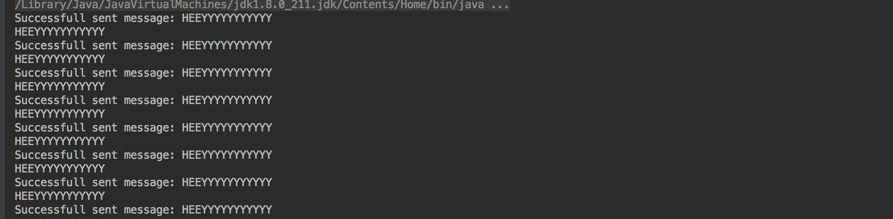

# message-queues-java
Simple java messaging queue application that utilizes AWS SQS.

## Use
* git clone repo
* Run the application from the terminal: ```gradle run```
* You should start to see messages from the queue
    * 

  


## Resources
* https://docs.aws.amazon.com/sdk-for-java/v1/developer-guide/examples-sqs-messages.html
* https://github.com/awsdocs/aws-doc-sdk-examples/blob/master/java/example_code/sqs/src/main/java/aws/example/sqs/SendReceiveMessages.java